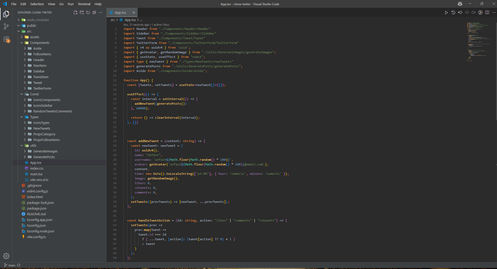
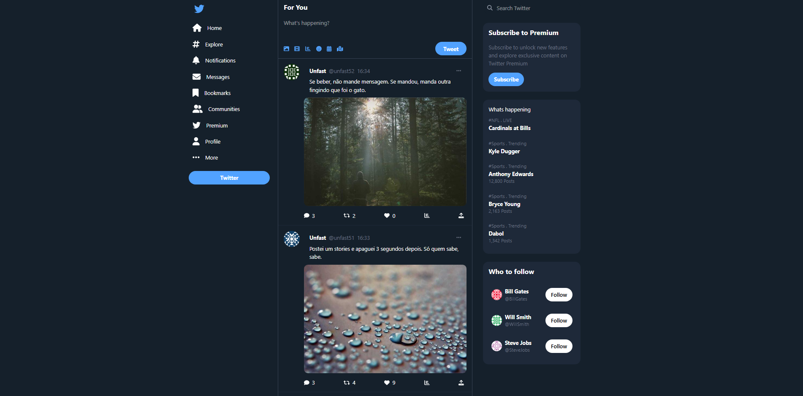
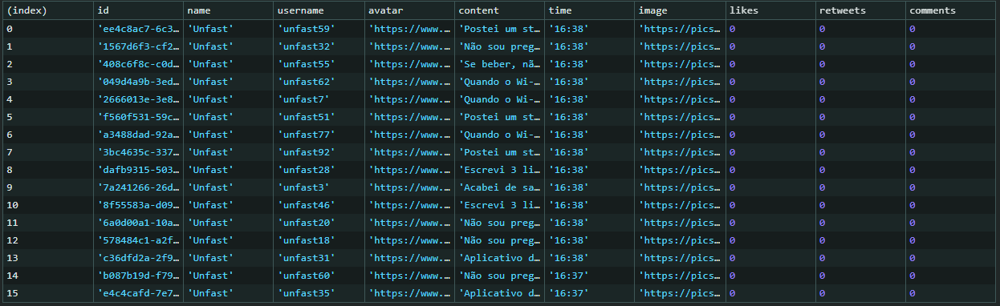

# 📸 Recursos Visuais

- **Imagem aleatória**: [https://picsum.photos/](https://picsum.photos/)
- **Avatar aleatório**: [https://pt.gravatar.com/](https://pt.gravatar.com/)

---

# 📦 Bibliotecas Utilizadas

- **Crypto-js** — Realizar `Hash()`
- **uuid** — Gerar ID aleatório
- **Tailwind** — Customizar a aplicação
- **fortawesome** — Ícones (Font Awesome)

---

# 📜 JavaScript

### ✨ Fundamentos

- Template Strings  
- Operadores  
- Variáveis  
- Arrow Function  
- Função com retorno  
- Função com parâmetro  
- Função de callback  
- Condicional  
- Estrutura de repetição  
- Eventos:
  - `map()`

### 📚 Biblioteca Nativa `Math`

- `Math.random()` — Gerar número aleatório entre `0` e `1`  
- `Math.floor()` — Arredondar número (geralmente usado com `random`)

### 📦 Módulos

- `import / export`  
- Estrutura de dados

### ⏱️ Timers API

- `setTimeout()` — Web API (Browser) / Node.js  
- `clearInterval()` — Web API (Browser) / Node.js  

---

# ⚛️ React Hooks

- `useState`  
- `useEffect`  

### 🧠 Conceitos React Abordados

- JSX  
- Componentes  
- Renderização condicional  
- Props  
- State Lift  
- Previous State  

---

# 🗂️ Estrutura de Pastas `/src`

- `assets`  
- `components`  
- `const`  
- `type`  
- `utils`  

---

# 🔷 TypeScript

- Criação de `interfaces` / `types` para componentes  
- Tipagem de:
  - Variáveis  
  - `state`  
  - Parâmetros  

